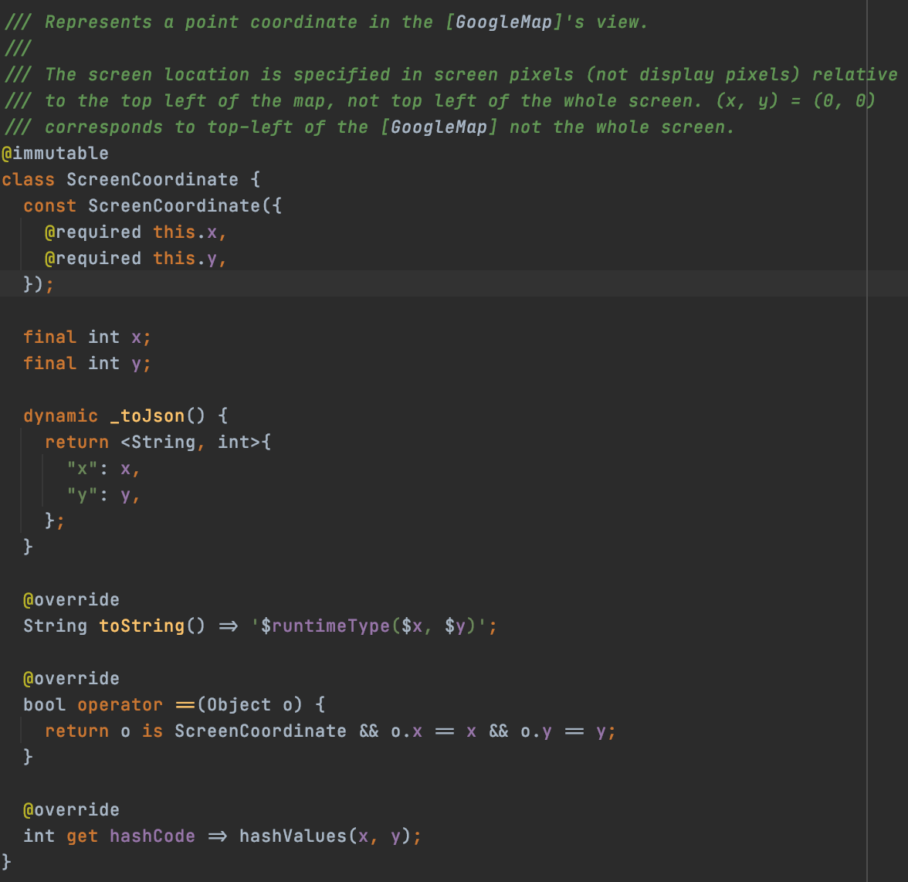

# Research Google Map Flutter and Polyline package

clone from https://github.com/rajayogan/flutter-googlemaps-routes  

from youtube video https://youtu.be/rvXRc1zwFpQ  

## Screenshot


## Breakdown: Polyline

```dart

void onMapCreated(GoogleMapController controller) {
    setState(() {
      _controller = controller;

      polyline.add(Polyline(
          polylineId: PolylineId('route1'),
          visible: true,
          points: routeCoords,
          width: 4,
          color: Colors.blue,
          startCap: Cap.roundCap,
          endCap: Cap.buttCap));
    });
  }
  
```

The poly line class is defined as follow  


Contains a List of pairs of Latitude and Longitude (coordinates)

### How it works

getCoorDinatesWithLocation from main API from Directions API. get Return a List of Latitude and Longitude

```dart
getsomePoints() async {
  var permissions =
  await Permission.getPermissionsStatus([PermissionName.Location]);
  if (permissions[0].permissionStatus == PermissionStatus.notAgain) {
    var askpermissions =
    await Permission.requestPermissions([PermissionName.Location]);
  } else {
    routeCoords = await googleMapPolyline.getCoordinatesWithLocation(
        origin: LatLng(40.6782, -73.9442),
        destination: LatLng(40.6944, -73.9212),
        mode: RouteMode.driving);
  }
}
```

```dart
/// Get coordinates using Location Coordinates
  /// Example : LatLng(40.677939, -73.941755)
  Future<List<LatLng>> getCoordinatesWithLocation({
    @required LatLng origin,
    @required LatLng destination,
    @required RouteMode mode,
  }) async {
    _data = new PolylineRequestData(
        originLoc: origin,
        destinationLoc: destination,
        mode: mode,
        locationText: false,
        apiKey: apiKey);

    _utils = new PolylineUtils(_data);

    return await _utils.getCoordinates();
  }
```

```dart
Future<List<LatLng>> getCoordinates() async {
    List<LatLng> _coordinates;

    var qParam = {
      'mode': getMode(_data.mode),
      'key': _data.apiKey,
    };

    if (_data.locationText) {
      qParam['origin'] = _data.originText;
      qParam['destination'] = _data.destinationText;
    } else {
      qParam['origin'] =
          "${_data.originLoc.latitude},${_data.originLoc.longitude}";
      qParam['destination'] =
          "${_data.destinationLoc.latitude},${_data.destinationLoc.longitude}";
    }

    Response _response;
    Dio _dio = new Dio();
    _response = await _dio.get(
        "https://maps.googleapis.com/maps/api/directions/json",
        queryParameters: qParam);

    try {
      if (_response.statusCode == 200) {
        _coordinates = decodeEncodedPolyline(
            _response.data['routes'][0]['overview_polyline']['points']);
      }
    } catch (e) {
      print('error!!!!');
    }

    return _coordinates;
  }
```

## Breakdown: GoogleMap

Screen Coordinates. Coordinates corresponding Google Map Widget display on the phone screen.

